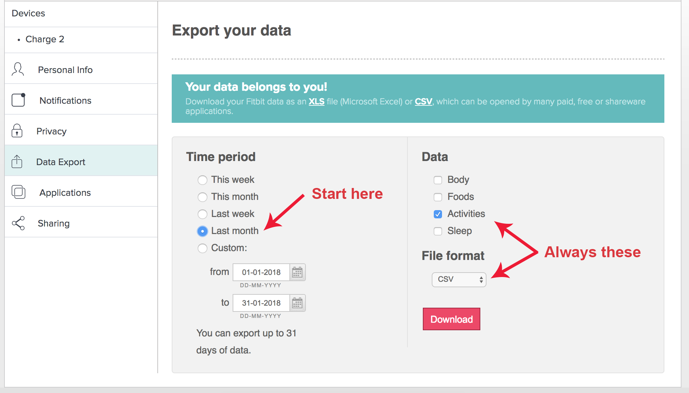
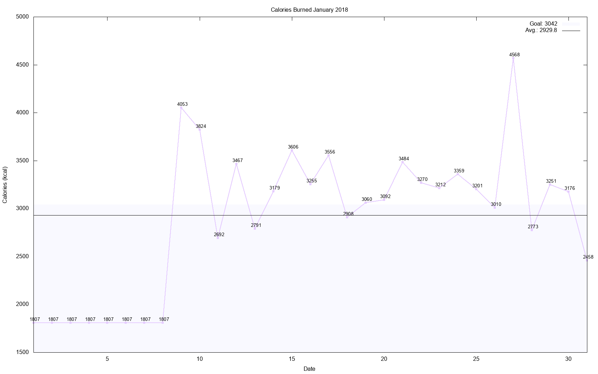
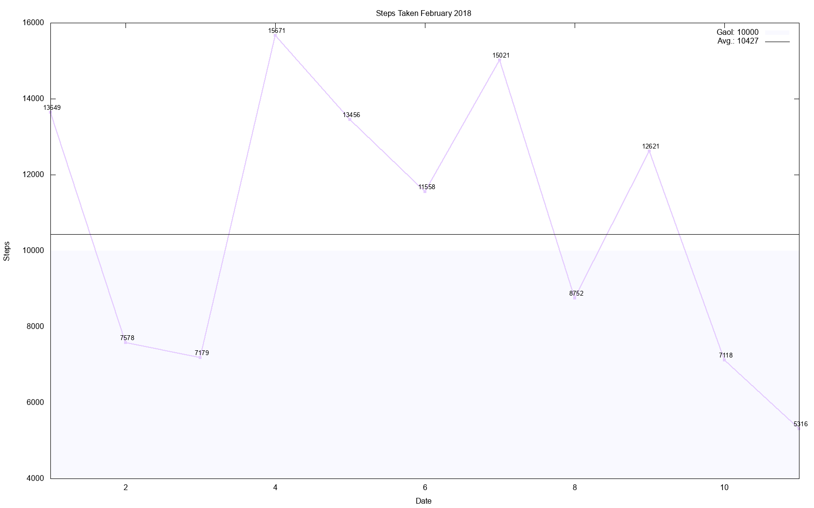
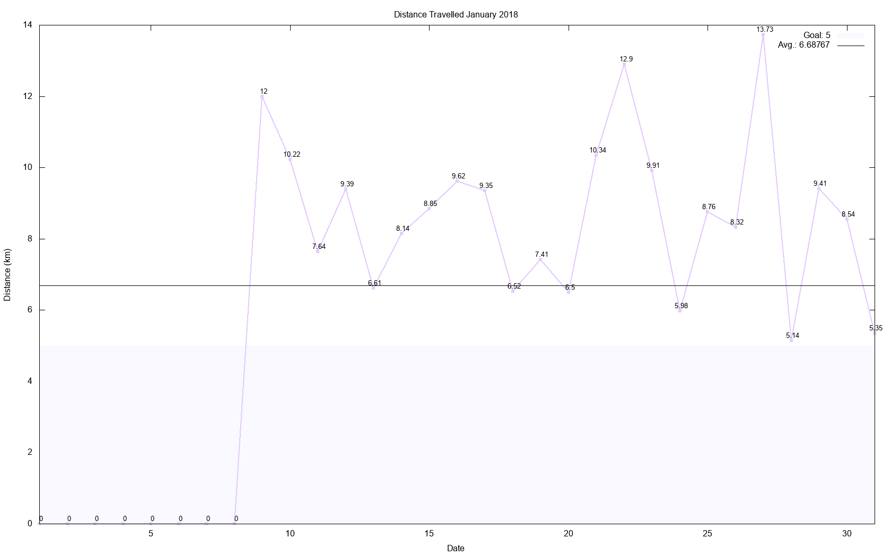
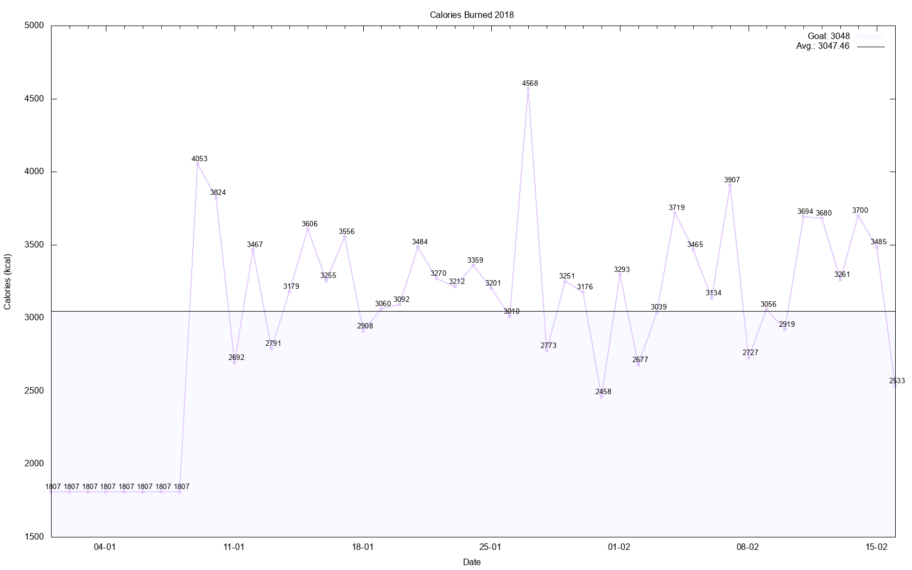

# fitplot

# What does it do?
It's a bash script for plotting FitBit Activities data exported from the FitBit 
Dashboard.

# What I'm using it with

| Hardware | MacBook Pro 2017                                                               |
| OS       | MacOS High Sierra 10.13.2                                                      |
| Terminal | Oh-My-Zsh 5.3                                                                  |
| Software | gawk 4.2.0, gnuplot 5.2 patchlevel 2, other built-in tools e.g., sed, cat etc. |

# How do you use it?
(1) Export an *Activities* report from https://www.fitbit.com/export/user/data *as 
a csv*:



(2) Execute fitplot on the downloaded csv file like so:

```bash
./fitplot fitbit_export_20180212.csv
```

(3) Three graphs will be generated: calories burned, steps taken, distance 
travelled.







Each graph plots the data points, their mean value and a goal value, which you 
can set yourself.

(BONUS) The script also generates a csv file containing year-to-date data, which 
is updated each time you run fitplot on a monthly report. You can then plot 
year-to-date graphs like so:

```bash
./fitplot --ytd
```

Three graphs will be generated: calories burned, steps taken, distance 
travelled. But this time they display year-to-date data:



# How can I set my goals?
Just edit the following variables in the script:

```bash
4: goalCals=3042    # kcal
5: goalSteps=10000    
6: goalDistance=5   # km
```

# Additional settings
The script needs a location to store output graphs and store/access the 
year-to-date csv file. I've set that to the cd *temporarily* but it's probably 
better to change it to a static location because the year-to-date csv needs to 
be read back in by the script when the --ytd flag is specified. Change the 
filepath by amending this variable:

```bash
13: outFP="./" 
```

The script also makes use of a single temporary file, which can be named anything
you like so long as it's accessible. The temporary file is used when 
copying/sorting/making sense of the questionable csv formatting from FitBit.
Change the filepath by amending this variable:
```bash
11: tmpFP="./fitplot.tmp" 
```

# Misc.
- The csv file passed as an argument is deleted when the script is run.
- It doesn't matter if you run fitplot on the same data twice, the year-to-date 
file doesn't store duplicates.
- It has *minimal* safety checking, so if you run fitplot on a csv file, make 
sure it's a valid *Activities* report exported from the FitBit Dashboard. Don't 
run it on a Body/Foods/Sleep report by accident like I did, because the output
is weird.

# Linux/Unix users
I hope it's largely compatible. I assume some of it won't be? 

# Windows users
??

# Questions/reviews
Nice comments to martin.handley@nottingham.ac.uk please :)


